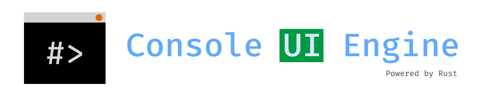

<!--
*** This README file is adapted from [othneildrew/Best-README-Template](https://github.com/othneildrew/Best-README-Template),
*** which is distributed under the MIT license.
-->

<!-- PROJECT LOGO -->
<br />
<p align="center">
  <a href="https://github.com/harrynull/ConsoleUIEngine">
    
  </a>

  <h3 align="center">Console UI Engine</h3>

  <p align="center">
  
[![crates-badge][crates-badge]](https://crates.io/crates/console_ui_engine_null)
[![GitHub][license-badge]](https://github.com/harrynull/ConsoleUIEngine/blob/master/LICENSE)
![GitHub Workflow Status][workflow-badge]
    
    A console UI engine written to learn Rust! (so not production-ready or representative of good Rust practices of course)
  </p>
</p>

## About The Project

![Screen Shot Linux][screenshot-linux]

![Screen Shot Windows][product-screenshot]

This project is written for me to learn Rust. As such, it might be flawed, slow, and not idiomatic or elegant.
It is strongly discouraged to use it in production environment. Criticism, feedback, suggestions are welcome and appreciated.

[crossterm](https://github.com/crossterm-rs/crossterm) is used for cross-platform terminal support.

## Features
* Cross-platform
* <span style="color:red">R</span><span style="color:green">G</span><span style="color:blue">B</span> support!
* Mouse and keyboard events support
* UI Components
  * button
  * check box
  * input
  * label
  * rectangle
  * text
  * typer

For extra awesomeness, I recommend using it with [cool-retro-term](https://github.com/Swordfish90/cool-retro-term).

## Usage

```toml
[dependencies]
console_ui_engine_null = "0.1.0"
```

<!-- LICENSE -->
## License

Distributed under the MIT License. See `LICENSE` for more information.

<!-- MARKDOWN LINKS & IMAGES -->
[product-screenshot]: https://raw.githubusercontent.com/harrynull/ConsoleUIEngine/master/docs/screenshot.png
[screenshot-linux]: https://raw.githubusercontent.com/harrynull/ConsoleUIEngine/master/docs/linux.png
[crates-badge]: https://img.shields.io/crates/v/console_ui_engine_null
[license-badge]: https://img.shields.io/github/license/harrynull/ConsoleUIEngine
[workflow-badge]: https://img.shields.io/github/workflow/status/harrynull/ConsoleUIEngine/Rust
